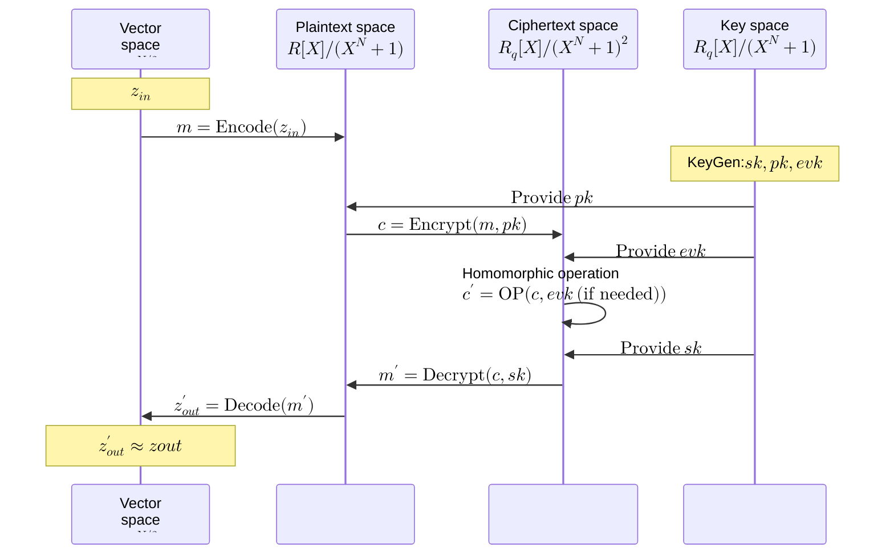

# ckks-rs-playground

```mermaid
sequenceDiagram
    participant V as Vector space<br>$$\mathbb{C}^{N/2}$$
    participant P as Plaintext space<br>$$\mathbb{R}[X]/(X^N+1)$$
    participant C as Ciphertext space<br>$$\mathbb{R}_q[X]/(X^N+1)^2$$
    participant K as Key space<br>$$\mathbb{R}_q[X]/(X^N+1)$$

    Note over V: $$z_{in}$$
    V->>P: $$m = \text{Encode}(z_{in})$$

    Note over K: KeyGen: $$sk, pk, evk$$
    K->>P: $$\text{Provide}\,pk$$
    P->>C: $$c = \text{Encrypt}(m, pk)$$

    K->>C: $$\text{Provide}\,evk$$
    C->>C: Homomorphic operation<br/>$$c' = \text{OP}(c, evk \,(\text{if needed}))$$<br/>

    K->>C: $$\text{Provide}\,sk$$
    C->>P: $$m' = \text{Decrypt}(c, sk)$$

    P->>V: $$z'_{out} = \text{Decode}(m')$$
    Note over V: $$z'_{out} \approx z{out}$$
```
